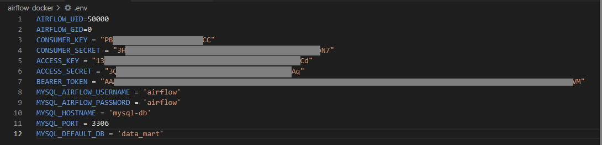
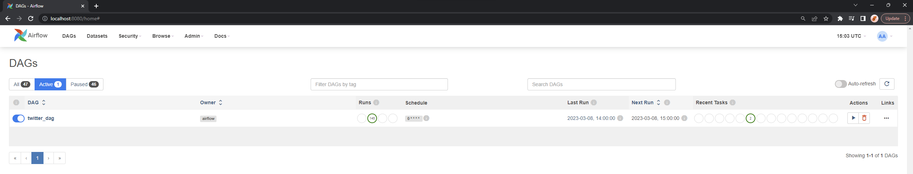

 # A batch ETL pipeline for Twitter tweet ingestion
 
Table of Contents
- [Description](#description)
- [Core Tech Stack](#core-tech-stack)
- [How It Works](#how-it-works)
- [Getting Started Yourself](#getting-started-yourself)
- [Changelog](#changelog)

## Description

This is a pipeline that calls the Twitter API v2 to get your account's timeline tweets and tweets from a target user, from the last full hour.

## Core Tech Stack

- Python 3.10
- Tweepy
- MySQL
- Apache Airflow
- Docker

## How It Works

### Tweepy

Twitter API v2 is available to developers for free. We use the Python package `tweepy` to create a client that allows us to make API calls. You may set up your developer account and get your API keys at the [Twitter developer portal](https://developer.twitter.com/en). Each tweet will have a username (@___ ), name, user_id, tweet_id, text (the contents of the tweet), and a created_at timestamp. 

### MySQL

We use a MySQL database to store the tweets.

### Apache Airflow

To orchestrate the pipeline, we'll put the two tasks (getting timeline tweets and target user tweets) into an Airflow DAG, scheduled hourly.

### Docker

To simplify the setting up of an Airflow instance (which requires a Unix-based OS) and a MySQL database on a local Windows machine, we use Docker containers (with the help of Docker Compose). Both Airflow and MySQL have official images in the [Docker Hub](https://hub.docker.com/) public repository, and the Airflow team also handily provides a ready [docker-compose.yaml file](https://airflow.apache.org/docs/apache-airflow/stable/howto/docker-compose/index.html#fetching-docker-compose-yaml).

## Getting Started Yourself

1. Clone this repository.
2. Ensure you have Docker and Airflow installed. (*you can follow this guide from Marc - [Running Airflow 2.0 with Docker in 5 mins](https://www.youtube.com/watch?v=aTaytcxy2Ck)*)
3. Ensure you have the other Python packages required to run twitter_scraper.py installed. (**notably - tweepy, pandas, pytz, sqlalchemy)
4. Create an .env file in the airflow-docker directory. This is required for twitter_scraper.py to make calls to the Twitter API and access your MySQL db. (*you may refer to the redacted .env below*) 

5. Start your terminal and navigate to mysql-docker. Run the command `docker-compose up -d` to start the MySQL container in the background. (*ensure you have Docker Desktop and your WSL2 running before this*)
6. Connect to your MySQL instance in your SQL workbench of choice, and run the init.sql script to create the schema, table, and `airflow` user with granted permissions. 
7. With MySQL out of the way, navigate to airflow-docker directory, and similarly run the `docker-compose up -d` command to start the Airflow containers which include the webserver, scheduler, and worker.
8. Visit the Airflow web UI at localhost:8080, scroll down the list to find the twitter_dag and switch it on. You should see this! 

## Changelog
